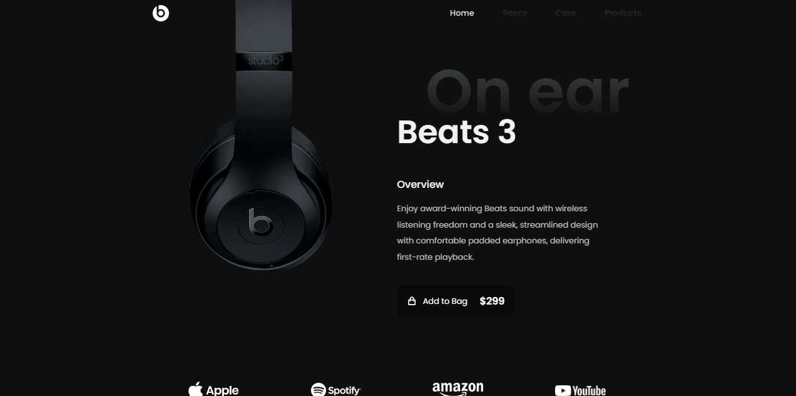

# 🎧 Responsive Landing Page - Headphones Beats 3

Este projeto é uma landing page responsiva para fones de ouvido "Beats 3", desenvolvida com HTML, CSS e JavaScript. O design é moderno, adaptável a dispositivos móveis e apresenta os principais recursos, produtos e ofertas da marca.

## 📸 Preview

## 🚀 Funcionalidades

- Layout 100% responsivo
- Menu de navegação com toggle e scroll suave
- Seções bem definidas: Home, Especificações, Case, Produtos, Promoção e Footer
- Estilização moderna com ícones da biblioteca Remix Icon
- Efeitos de entrada com ScrollReveal.js
- Interação com o botão de "Add to Bag" e "Shop Now"
- Formulário para subscrição por e-mail
- Links para redes sociais (Facebook, Instagram, Twitter)

## 🛠️ Tecnologias Utilizadas

- HTML5
- CSS3
- JavaScript (vanilla)
- Responsividade com Grid e Flexbox

 

   

   

<h1 align="center"></h1>

  

 

<h4 align="center"> DarkBeats Landing Page </h4>

   

📱 Responsividade
A interface foi desenhada para se adaptar perfeitamente a diferentes tamanhos de tela, proporcionando uma ótima experiência tanto em desktop quanto em dispositivos móveis.

✍️ Autor
Feito com ❤️ e café. by [Leonardo Schloesser](https://github.com/devwebschloesser)

📝 Licença
Este projeto está licenciado sob a licença MIT - consulte o arquivo LICENSE para mais detalhes.

   

&#xa0;

<a href="#top">Back to top </a>
